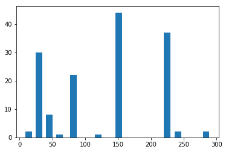
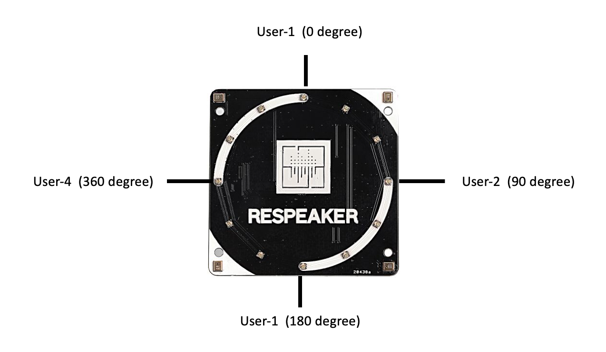
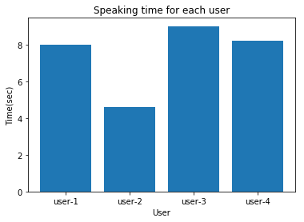
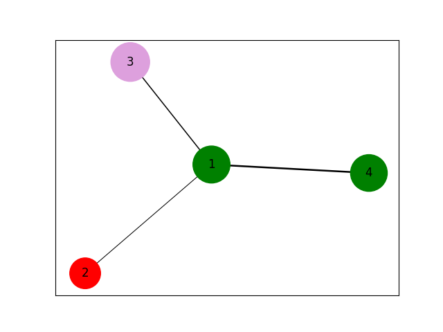

# ReAudio  

**ReAudio** is a Python library for analyzing data from the **ReSpeaker 4-Mic Array** using its built-in **Direction of Arrival (DoA)** and **Voice Activity Detection (VAD)** algorithms. The library simplifies extracting speaking times, generating edge lists for social network analysis, and visualizing interaction patterns among participants.

---

## Features

- Extract speaking times for each participant
- Generate edge lists for social network analysis
- Visualize interaction patterns
- Built-in support for ReSpeaker's DoA and VAD algorithms

## Installation
Install the dependencies using the following command
```sh
pip install -r requirements.txt
```

## Usage

### 1. Importing the Library

```python
from ReAudio import ReAudio
```

### 2. Initializing with Data
```python
re = ReAudio('./data/demo.csv')
```

### 3. Available Methods

#### `getHighestFourDegree(plot)`

Processes the input file and returns the four most frequently occurring Direction of Arrival (DoA) angles in degrees.

**Parameters**:
* plot (Boolean type): if want to plot the distribution of DoA present in the data.

**Returns**:
Returns a list of four most occuring DoA angles.

**Example Usage**:
```python
from ReAudio import ReAudio
re = ReAudio('./data/demo.csv')
degrees = re.getHighestFourDegree(True)
```


#### `assignUserLabel()`

Assigns user identifiers (1-4) based on Direction of Arrival (DoA) data, assuming participants are seated in clockwise order around the ReSpeaker array.

##### Orientation Assumptions


##### Working
1. **Identifies Top Directions**:
   - Extracts the four most frequent DoA angles using `getHighestFourDegrees()`
   - Sorts these angles in ascending order (0° to 360°)

2. **User Mapping**:
   - 1st angle → User 1 (0° reference)
   - 2nd angle → User 2 (90°)
   - 3rd angle → User 3 (180°)
   - 4th angle → User 4 (270°)

3. **Label Assignment**:
   - For each recorded DoA value:
      - Calculates angular difference to all four reference directions
      - Assigns the label of the closest reference direction
   - Adds a 'users' column to the dataset with these labels

##### Returns
- `DataFrame`: Original dataset with added 'users' column containing integer labels (1-4)

**Example Usage**:

```python
from ReAudio import ReAudio
re = ReAudio('./data/demo.csv')
re.assignUserLabel()
```

#### `getSpeakingTime(plot,time)`
Calculates the cumulative speaking duration for each participant based on voice activity detection events. Each entry in the file represents a speech activity for 200 ms. This function simply counts the number of entries for each user and then multiply it with 200/1000 to get speaking time in seconds.

**Parameters**:
* plot (Boolean type): if want to plot the speaking time for each user, specify True otherwise False.
* time(string, possible values=['sec','min','hour']): Specify the time unit for computing speaking time.

**Returns**
* Dictionary containing user speaking time in the form `user:speaking time`.

**Example Usage:**
```python
from ReAudio import ReAudio
re = ReAudio('./data/demo.csv')
re.getSpeakingTime(True,'sec')
```


#### `generateEdgeFile()`
Generates a weighted edge list representing speaker turn-taking patterns, suitable for social network analysis.

##### Noise Filtering Methodology
- **Minimum Duration Threshold**: 
  - Requires ≥4 consecutive entries (800ms) to qualify as valid speech
  - Filters brief false positives from DoA detection
- **Transition Logic**:
  - Only considers transitions between different speakers
  - Adjacent entries from same speaker are merged

##### Output Format
Creates `edges.txt` with tab-separated values:

**Example**

```python
a = [1,1,1,2,2,2,2,3,3]
continuous_occurrence = {1:3,2:4,3:2}
```
First the function counts the continuous occurrences of speaking activities. Then, it uses those occurrences to remove entries having less than 4 occurrence. After this step final user speaking sequence is generated. This sequence is then used to generate edge list. This function generates a file 'edges.txt' which can be used by graph generating software to draw graphs.

#### `drawNetwork()`
This function generates an interaction network among participants. If an edge between two nodes appears multiple times, its weight increases accordingly. The thickness of each edge reflects the frequency of interactions.

Nodes are color-coded based on speaking time using three distinct colors:

* **Green**: Indicates users who have spoken more than the average speaking time.

* **Red**: Represents users who have spoken less than the average.

* **Plum**: Used for users whose speaking time is close to the average.

**Example usage:**
```python
from ReAudio import ReAudio
re = ReAudio('./data/demo.csv')
re.assignUserLabel()
re.drawNetwork()
```

